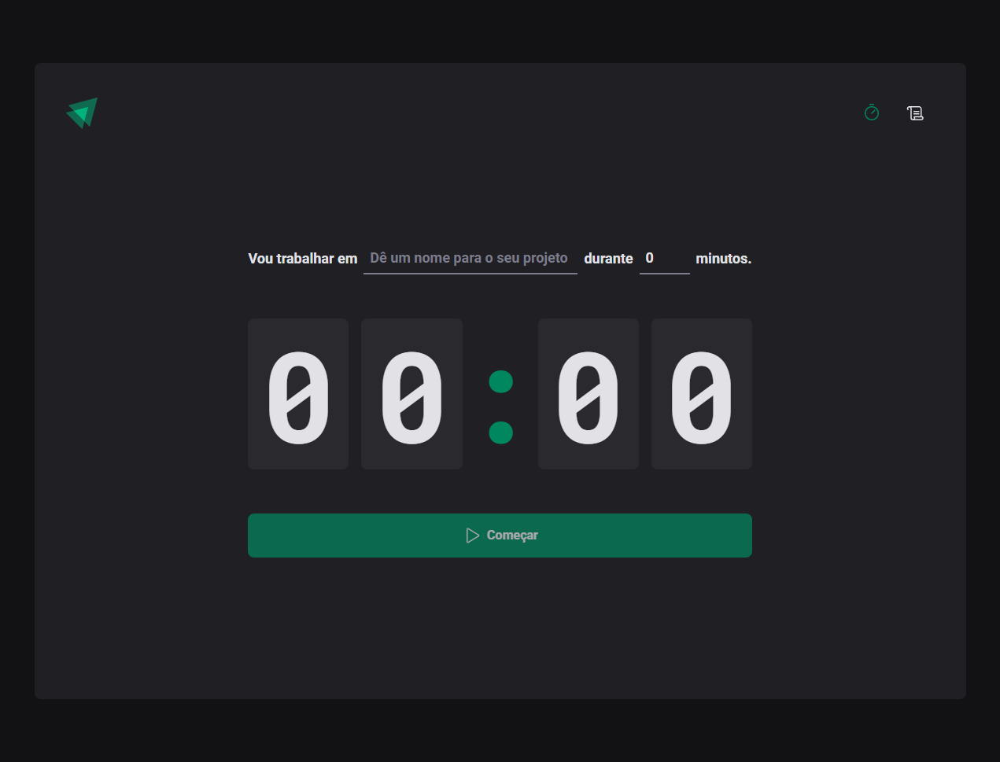

<h1 align="center"> Ignite Timer </h1>

  <a href="#-tecnologias">Tecnologias</a>&nbsp;&nbsp;&nbsp;|&nbsp;&nbsp;&nbsp;
  <a href="#-projeto">Projeto</a>&nbsp;&nbsp;&nbsp;|&nbsp;&nbsp;&nbsp;
  <a href="#-layout">Layout</a>&nbsp;&nbsp;&nbsp;|&nbsp;&nbsp;&nbsp;
  <a href="#memo-licença">Licença</a>

  

 

  

Projeto desenvolvido através da Trilha Ignite da Rocketseat

## 🚀 Tecnologias

Esse projeto foi desenvolvido com as seguintes tecnologias:

- HTML e CSS
- [TypeScript](https://www.typescriptlang.org/)
- [React](https://react.dev/)
- [Vite](https://vitejs.dev/)
- [Hooks](https://legacy.reactjs.org/docs/hooks-intro.html)
- [Immer](https://immerjs.github.io/immer/)
- [Zod](https://articles.wesionary.team/react-hook-form-schema-validation-using-zod-80d406e22cd8)

## 💻 Projeto

O Rocketpay é um componente que simula o formulário de preenchimento de cartão de crédito, onde é possível adicionar máscara aos inputs e atualizar elementos HTML via DOM.

## 🔖 Layout

Você pode visualizar o layout do projeto através [DESSE LINK](https://www.figma.com/file/CVMCjQD4CVUYuoU06SFnrl/Ignite-Timer-(Community)?node-id=0-1&t=mJO4rbRgzNBvXSes-0). É necessário ter conta no [Figma](https://figma.com) para acessá-lo.

## 💜 Contatos

[LinkedIn](https://www.linkedin.com/in/diego-bonze-518225208/)

diegobonze747@gmail.com
